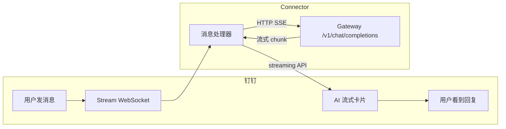

# 项目分析报告: DingTalk-Real-AI/dingtalk-moltbot-connector

## 项目概览
- **项目地址**: https://github.com/DingTalk-Real-AI/dingtalk-moltbot-connector
- **项目描述**: 将 钉钉机器人 / 钉钉 DEAP Agent 连接到 OpenClaw Gateway 的OpenClaw Plugin，支持 AI Card 流式响应
- **主要语言**: TypeScript
- **星标数**: 1219
- **复刻数**: 71
- **开放问题**: 29
- **许可证**: MIT
- **最后更新**: 2026-02-10T08:29:10Z
- **主题标签**: 

## 一句话介绍
DingTalk-Real-AI/dingtalk-moltbot-connector 是一个基于 TypeScript 的 对话式AI / 聊天机器人 项目，具有 1219 个星标。

## 核心亮点
活跃的开发维护

## 应用领域
对话式AI / 聊天机器人

## 技术栈
- JavaScript/Node.js
- 依赖包: 

## 核心特性
- 未识别出核心特性

## 扩展能力
低至中 - 代码中检测到扩展能力

## 执行流程解析
基于代码库分析，该项目的主要执行流程可能包括：
1. 初始化阶段：根据配置文件或命令行参数设置运行环境
2. 输入处理：接收用户输入或任务指令
3. 代理循环：执行AI推理、工具调用、行动规划等
4. 输出处理：生成响应或执行结果
5. 记忆/状态管理：更新内部状态或记忆系统

(具体执行流程需参考源代码实现)

## 仓库结构
```text
.
```

## 优势分析
- 显著人气 (1219 ⭐)
- 社区兴趣 (71 复刻)
- 维护良好 (低开放问题数: 29)
- 许可证清晰 (MIT)

## 潜在不足
- 文档有限
- 缺少示例
- 无可见测试套件

## README预览
```markdown
# DingTalk OpenClaw Connector

以下提供两种方案连接到 [OpenClaw](https://openclaw.ai) Gateway，分别是钉钉机器人和钉钉 DEAP Agent。

## 快速导航

| 方案 | 名称 | 详情 |
|------|------|------|
| 方案一 | 钉钉机器人集成 | [查看详情](#方案一钉钉机器人集成) |
| 方案二 | 钉钉 DEAP Agent 集成 | [查看详情](#方案二钉钉-deap-agent-集成) |

# 方案一：钉钉机器人集成
将钉钉机器人连接到 [OpenClaw](https://openclaw.ai) Gateway，支持 AI Card 流式响应和会话管理。

## 特性

- ✅ **AI Card 流式响应** - 打字机效果，实时显示 AI 回复
- ✅ **会话持久化** - 同一用户的多轮对话共享上下文
- ✅ **超时自动新会话** - 默认 30 分钟无活动自动开启新对话
- ✅ **手动新会话** - 发送 `/new` 或 `新会话` 清空对话历史
- ✅ **图片自动上传** - 本地图片路径自动上传到钉钉
- ✅ **主动发送消息** - 支持主动给钉钉个人或群发送消息

## 架构



## 效果


## 安装

### 1. 安装插件

```bash
```

## 补充说明
- 文档完善度: 缺失或简单
- 测试覆盖度: 缺失或简单
- 示例丰富度: 缺失或简单

---
*分析时间: 2026-02-10*
